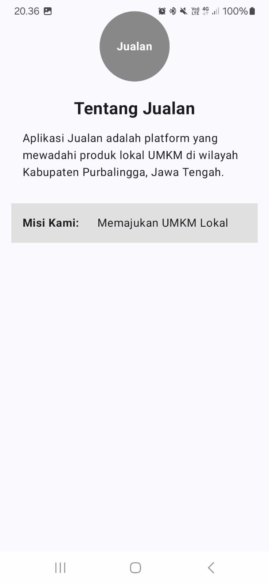
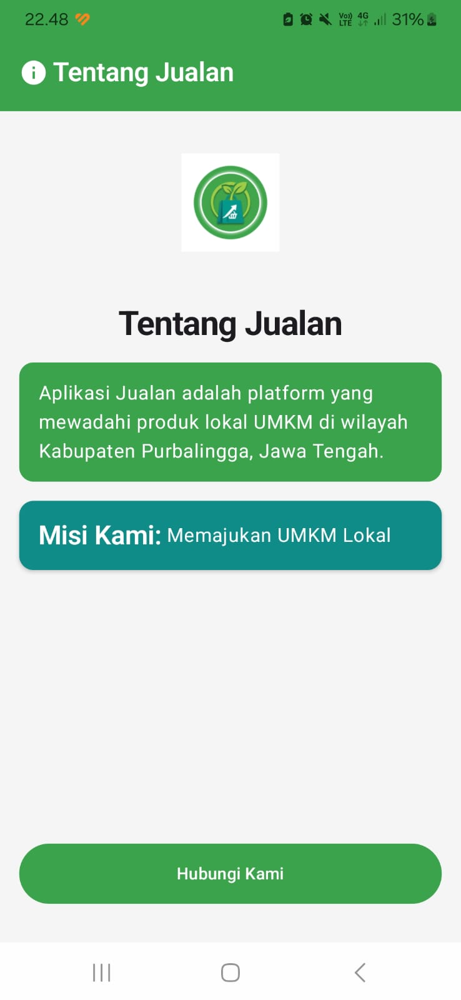
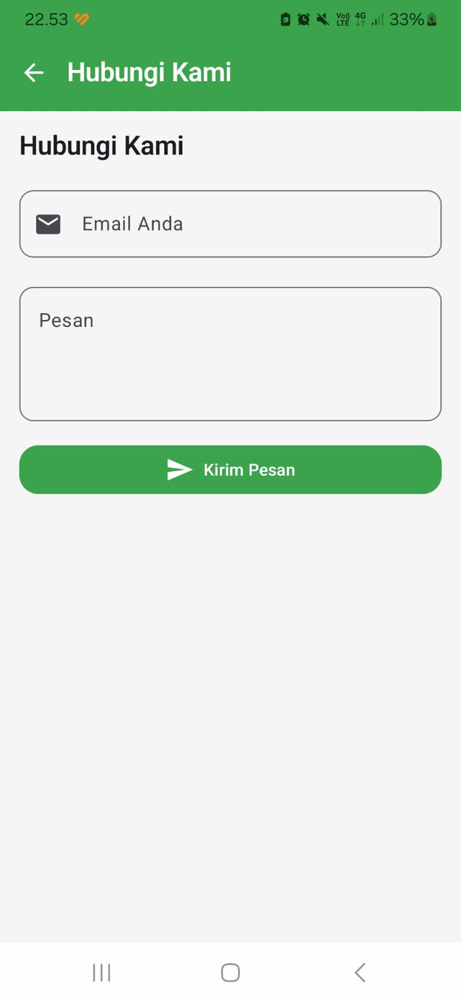
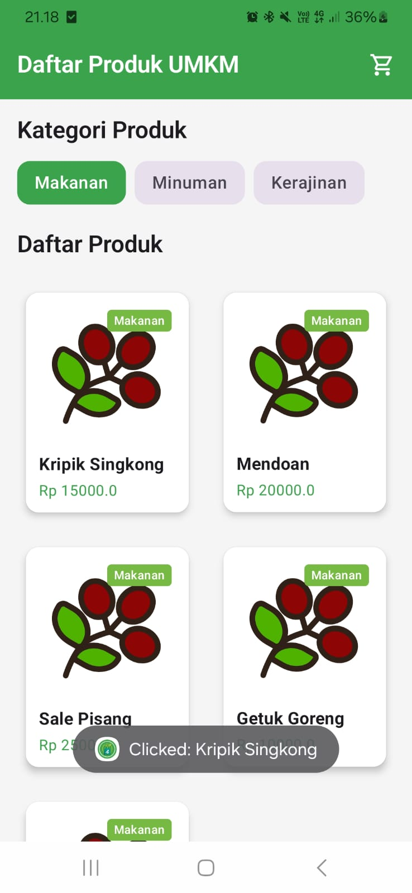
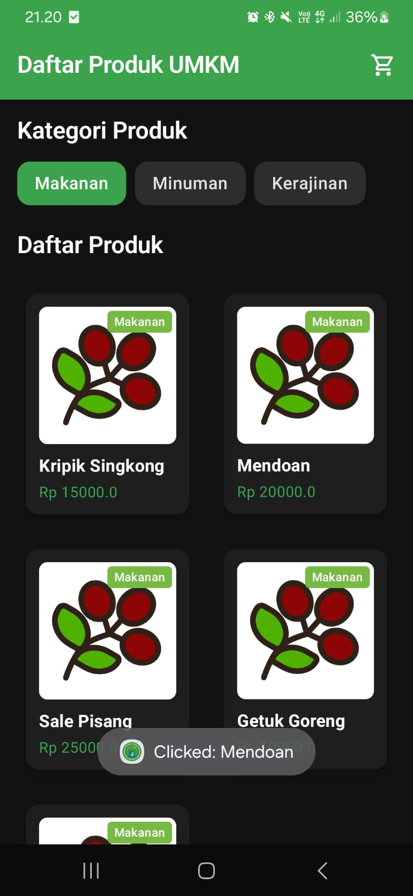
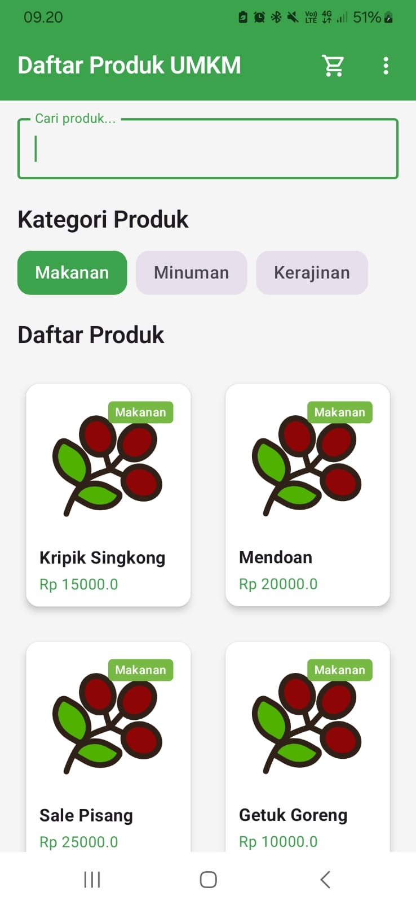
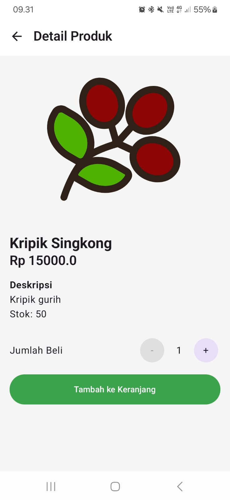
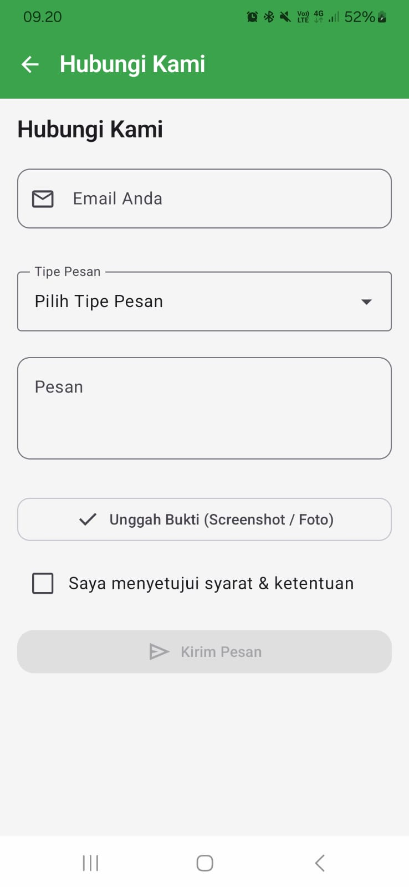

# Laporan Praktikum Pemrograman Mobile

**Nama**        : Nindya Alif Romland  
**NIM**         : H1D024031  
**Shift**       : Awal D / Akhir E  
**Praktikum**   : Pemrograman Mobile

---

## 📝 Tugas Pertemuan 1
**Tanggal**: Rabu, 2 September 2026

**Kesimpulan Praktikum:**  
Pertemuan pertama berfokus pada inisialisasi awal proyek dan dasar pemrograman Jetpack Compose.

---

## 📝 Tugas Pertemuan 2
**Tanggal**: Rabu, 9 September 2026

**Kesimpulan Praktikum:**  
Pertemuan kedua berfokus pada implementasi komponen Material Design 3 dan pembuatan Form.

---

## 📝 Tugas Pertemuan 3
**Tanggal**: Rabu, 16 September 2026

**Kesimpulan Praktikum:**  
Pertemuan ketiga berfokus pada penerapan pembuatan list data secara dinamis menggunakan Lazy Layouts.

---

## 📝 Tugas Pertemuan 4
**Tanggal**: Rabu, 23 September 2026

**Kesimpulan Praktikum:**  
Pertemuan keempat berfokus pada implementasi Jetpack Navigation untuk menghubungkan antar halaman (Daftar Produk ke Detail Produk dengan argumen `productId`, serta halaman Form Hubungi Kami via Dropdown Menu).
